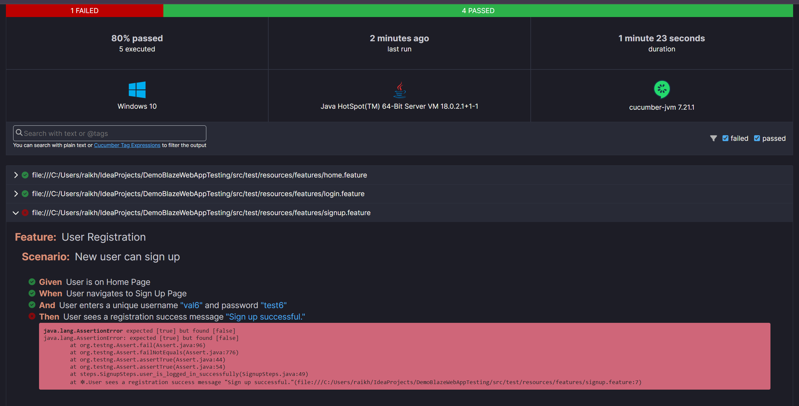

# Bug Report: Registration Fails with Already Existing Username

**Title:** Registration fails when attempting to register with an already existing username.

## Steps to Reproduce:
1. Open the application [https://www.demoblaze.com/](https://www.demoblaze.com/).
2. Click on the "Sign Up" button in the menu.
3. Enter an already existing username (e.g., "val6") in the username field.
4. Enter a password (e.g., "test6") and submit the form.
5. Observe the behavior of the registration process.

## Actual Results:
- An alert appears with the message: "This user already exists."

## Expected Results:
- The system should display an alert with a success message, such as "Sign up successful," when the registration is completed successfully.

## Bug Severity:
Medium (This bug prevents users from registering properly with unique usernames.)

## Test Environment Details:
- **OS:** Windows 10
- **Browser:** Google Chrome 134.0.6998.118

## Screenshots/Logs:

