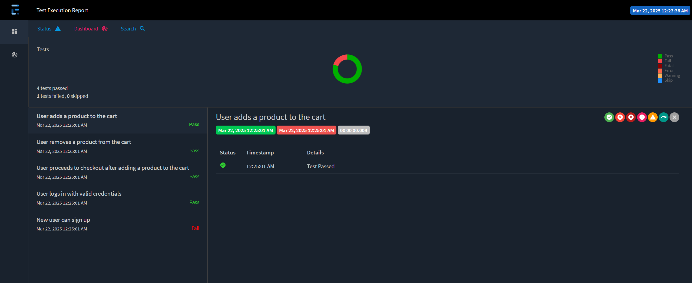

# DemoBlaze Web Application Test Automation Framework

## **📌 Overview**
This project is an Selenium WebDriver and Cucumber (BDD) Test Automation Framework, designed to test the DemoBlaze web application. The framework utilizes Java, TestNG, and Maven for dependency management, build automation, and test execution. It follows the Page Object Model (POM) design pattern for maintaining separation of concerns and improving maintainability.
## **🛠️ Setup and Installation**
### **Prerequisites**
Before getting started, ensure you have the following tools installed:
- **Java 18** or later
- **Maven (for dependency management and build automation)**
- **Chrome Browser**
- **Chromedriver** (managed automatically via WebDriverManager)

### **Installing Maven** ###
If Maven is not already installed, you can download it from the Apache Maven website and follow the installation instructions.

### **Clone the Repository**
git clone https://github.com/RaikhelsonV/DemoBlazeWebAppTesting/tree/main

### **Running the Tests:**
- To execute all tests: mvn test
- TestRunner: Executes all test scenarios defined in the TestRunner class.
- Specific Features: Run individual feature files (home.feature, login.feature, signUp.feature) for focused testing.

### **After running tests, reports are generated at:**
- target/cucumber-reports/report.html

- target/reports/ExtentReport_timeStamp.html

📌 Technologies Used
- Selenium WebDriver 4.29.0
- Cucumber (BDD) 7.21.1
- TestNG 6.14.3
- WebDriverManager 6.0.0
- Extent Reports 5.1.2
- Cucumber Reporting 5.8.4

📩 Contributors
- Valerie Raikhelson 
- raikhelsonvalerie@gmail.com

